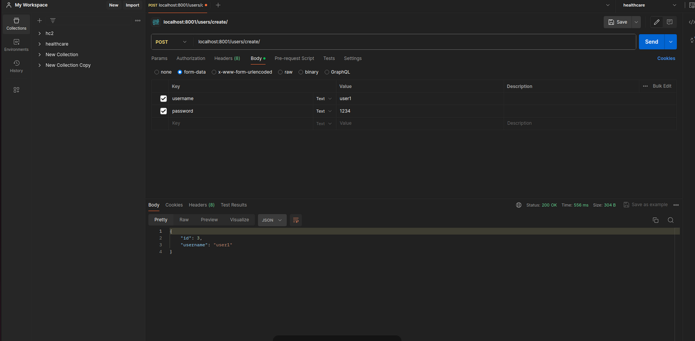
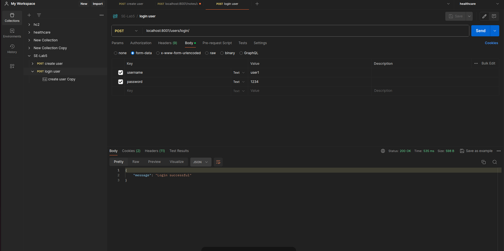
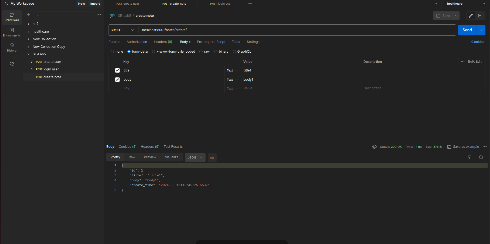
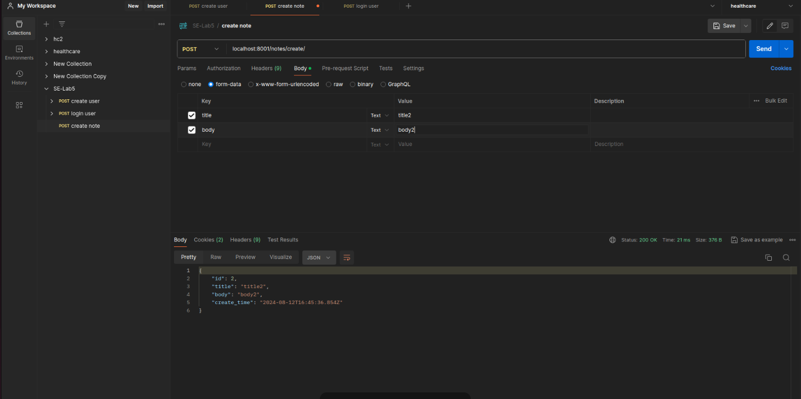
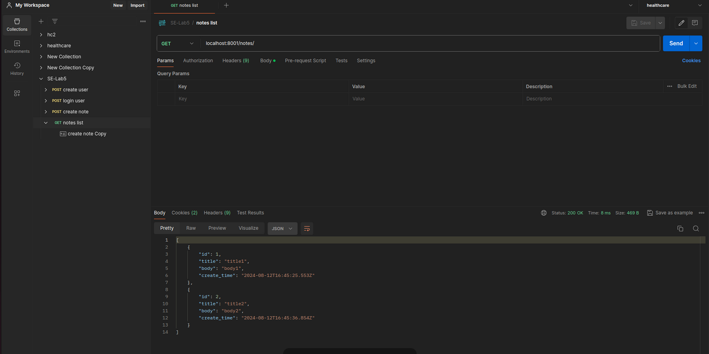

# Notes project

## Requirements
- Python3
- Postgres

## How to run

### Setup virtual environment

#### Create venv
```
python -m venv ./venv
```

#### Install requirements
```
python -m pip install -r requirements.txt
```

#### Activate venv
```
source ./venv/bin/activate
```

### Setup database
1. Create an instance of postgres database
2. Make migrations
    ```
    python manage.py makemigrations
    ```
3. Migrate
    ```
    python manage.py migrate
    ```

### Create an admin
```
python manage.py createsuperuser
```

## Important end-points
```
users/login/ --> login a user
users/me/ --> get information of logged-in user
users/create/ --> create a user
users/<id>/delete/ --> delete a user
notes/ --> list all notes of current user
notes/<id>/ --> get details of a note
notes/create/ --> create a note
notes/<id>/delete/ --> delete a note
```

## استقرار پروژه

### dockerfile

در ابتدا، ورژن docker compose را مشخص کرده‌ایم. ما از ورژن 3.8 استفاده می‌کنیم.

سپس به تعریف سرویس‌ها می‌رسیم.
ما دو سرویس db و web را داریم که به ترتیب مربوط به دیتابیس و جنگو هستند.
مقدار image مشخص می‌کند که چه image و چه نسخه‌ای از آن باید pull شود.

در بخش environment سرویس دیتابیس، متغیر‌های محیطی مربوط به دیتابیس شامل یوزرنیم و پسورد آن را مشخص می‌کنیم.
برای پایتون چون که این مقادیر در فایل .env هستند، از env_file استفاده می‌کنیم.

برای این که دیتابیس persistent باشد و با ریست شدن کانتینر دیتای آن از بین نرود،
از volume استفاده کرده ایم و یک فولدر از سیستم میزبان را به فولدری از کانتینر که اطلاعات دیتابیس در‌ آن ذخیره می‌شود متصل کرده‌ایم.

برای این که کانتینر‌هایی که ساخته‌ایم بتوانند با هم از طریق شبکه حرف بزنند،
یک شبکه برای آن‌ها در بخش networks مشخص می‌کنیم.

همچنین برای سرویس جنگو هم از volume استفاده کرده‌ایم و فولدری که کد ما در آن قرار دارد را mount کرده‌ایم تا با تغییر کد،
بتوانیم از داخل کانتینر کد چدید را اجرا کنیم و نیاز به ساخت ایمیج جدید نباشد.

همچنین در هنگام بالا آوردن ایمیج جنگو، نیاز داریم که نصب نیازمندی‌ها و migrationها را انجام دهیم که در بخش commands این کار را می‌کنیم.

همچنین مقدار depends_on را مشخص کردم‌ایم که مشخص کنیم حتما باید قبل از جنگو، سرویس دیتابیس بالا آمده باشد.

در نهایت هم در بخش ports، پورتی از کانتینر جنگو که به پورتی از سیستم میزبان وصل می‌شود را مشخص می‌کنیم.
حال می‌توانیم به localhost:8000 درخواست بزنیم و نتیجه را مشاهده نماییم.

مقادیر volumes و networks را هم که قبلا به آن‌ها اشاره کرده بودیم،‌ در انتهای فایل تعریف می‌کنیم.

### notes/settings.py

نکته: برای این که جنگو بتواند به دیتابیس وصل شود، باید در فایل settings، تنظیمات مربوط به دیتابیس را هم انجام می‌دادیم:

```python

DATABASES = {
    'default': {
        'ENGINE': 'django.db.backends.postgresql',
        'NAME': 'mydatabase',
        'USER': 'myuser',
        'PASSWORD': 'mypassword',
        'HOST': 'db',
        'PORT': '5432'
    }
}
```

## ارسال درخواست به وب‌سرور


## postman
پورت ۸۰۰۰ شلوغ بود و بجای آن از پورت ۸۰۰۱ استفاده کردیم.
### ۱- ساخت یوزر جدید


### ۲- ورود به اکانت


### ۳- ساخت یادداشت اول


### ۴- ساخت یادداشت دوم


### ۵- دریافت یادداشت‌ها


## تعامل با داکر

برای دیدن لیست imageها می‌توانیم از دستور `docker images`
و برای دیدن لیست کانتینر‌ها از دستور `dokcer ps`
استفاده می‌کنیم.


برای اجرای دستور داخل کانتینر،‌ ابتدا ID آن را از خروجی دستور `docker ps` کپی می‌کنیم.
سپس دستور زیر را وارد می‌کنیم:

```shell

docker exec -it <mycontainer> bash
```
در اینجا، بعد از ورود به کانتینر، دستور `ls` را اجرا کرده‌ایم.
(چون pull کردن ایمیج پایتون خیلی طول می‌کشید، روی یک کانتینر دیگر اجرا کردم‌ایم)


## پرسش‌ها
### پاسخ سوال یک
وظایف Dockerfile، image و container را توضیح دهید.
داکرفایل: یک فایل متنی است که دستورات لازم برای ساخت ایمیج داکر را مشخص می‌کند. این فایل شامل دستوراتی برای برای ساخت اپلیکیشن می‌باشد که منظور همان تعیین ایمیج پایه، کپی کردن فایل‌ها، نصب وابستگی‌ها و اجرای دستورات می‌باشد.

ایمیج: یک بسته مستقل شامل تمام ملزومات اجرای نرم‌افزار است که از داکرفایل ساخته می‌شود. از ملزومات اجرای نرم‌آفزار می‌توان کتابخانه‌ها، متغیرهای محیطی و فایل‌های پیکربندی را نام برد.ایمیج از طریق یک داکرفایل و با استفاده از دستور docker build ساخته می‌شود. بعد از انجام این مراحل، ایمیج‌هارا می‌توان به اشتراک گذاشت و برای راه‌اندازی کانتینرها استفاده کرد.

کانتینر: یک نمونه اجرایی از ایمیج داکر است که در محیطی ایزوله اجرا می‌شود. منظور از محیط ایزوله یک نوع هسته‌ی سیستم عامل می‌باشد. به همین دلیل سبک وسریع می‌باشند. هر کانتینر به صورت مستقل عمل می‌کند اما می‌تواند از طریق شبکه با سایر کانتینرها یا سرویس‌ها تعامل داشته باشند. لازم به ذکر است که آنها با دستور docker run راه اندازی می‌شوند.


### پاسخ سوال دو
از kubernetes برای انجام چه کارهایی می‌توان استفاده کرد؟ رابطه آن با داکر چیست؟
کوبرنتیز: پلتفرمی برای مدیریت خودکار استقرار، مقیاس‌گذاری و مدیریت کانتینرها است. همچنین به ما این امکان را می‌دهند که کلاسترهایی از کانتینرها را مدیریت کنیم و اطمینان حاصل کنیم که این کانتینرها به درستی اجرا می‌شوند.
رابطه با داکر: داکر کانتینرها را ایجاد و اجرا می‌کند و کوبرنتیز این کانتینرها را در مقیاس بزرگ مدیریت می‌کند.  کوبرنتیز می‌تواند با چندین زمان‌اجرای کانتینر، از جمله داکر، برای مدیریت چرخه حیات کانتینرها کار کند. با این حال، لازم به ذکر است که استفاده از داکر برای کار با کوبرنتیز الزامی نیست، زیرا کوبرنتیز می‌تواند با زمان‌اجرای‌های دیگری مانند containerd و CRI-O نیز کار کند.

